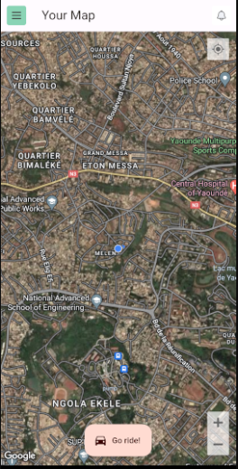
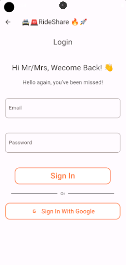
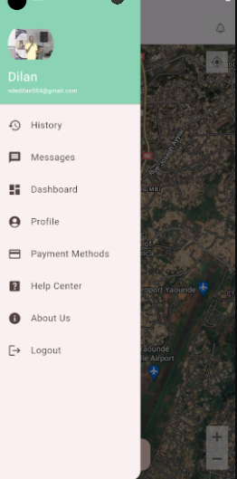
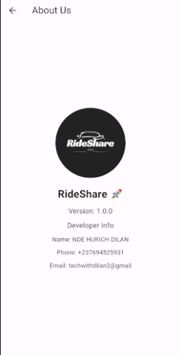

# Ride Sharing App 🚗💨


Ride Sharing App is a cutting-edge application designed to connect drivers and passengers in real-time. Built with Flutter and Dart, this app offers a seamless user experience and robust functionality.

## 📸 Screenshots

| First Screen  | Map Detail | Sign In | 
| ------------- | ------------- | ------------- |
|   |  |  |

| Menu Page | About Us |
 ------------- | ------------- | 
  |  |

## 🚀 Features

- 🆕 User Registration
- 🚗 Driver and passenger dashboard
- 📍 Real-time location tracking
- 🚗 Driver and passenger matching
- 📝 Ride history
- 💰 In-app payments(Cash only)

## 🛠️ Installation

Follow these steps to get the app up and running!

**Step 1:**

Download or clone this repo by using the link below:

```sh
git clone https://github.com/Nde-Dilan/ride_sharing_app.git 
```
**Step 2:**

Go to project root and execute the following command in console to get the required dependencies:

```sh
flutter pub get
```
**Step 3:**

Navigate to the project directory in terminal and run the app:

## 🧪 Running the tests (the default ones 🥲)
Execute the following command in console to run the tests:

```sh
flutter test 
```

## 🛠️ Built With
 * Flutter - Beautiful native apps in record time.
 * Dart - Optimized for UI, development with less code.

## 🤝 Contributing
Contributions, issues and feature requests are welcome! Contact [Nde Dilan](mailto:ndedilan504@gmail.com)

## 👥 Authors
**Nde Dilan** - Initial work - Nde-Dilan
See also the list of contributors who participated in this project.

## 📜 License
This project is licensed under the MIT License - see Google  for details.

## 🙏 Acknowledgments
 * Thanks to Flutter & Dart for the amazing framework and language.
 * Inspiration : Thanks to the figma and dribble community etc...

